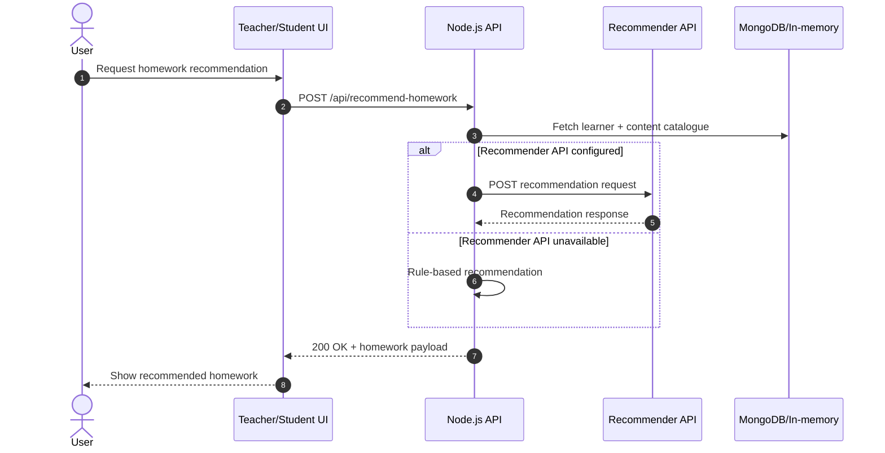
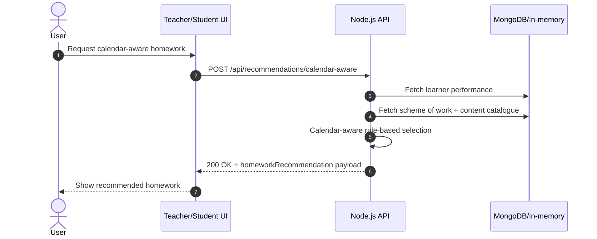
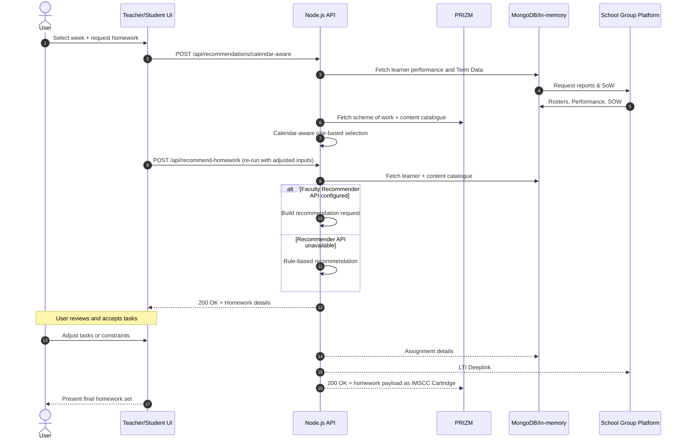
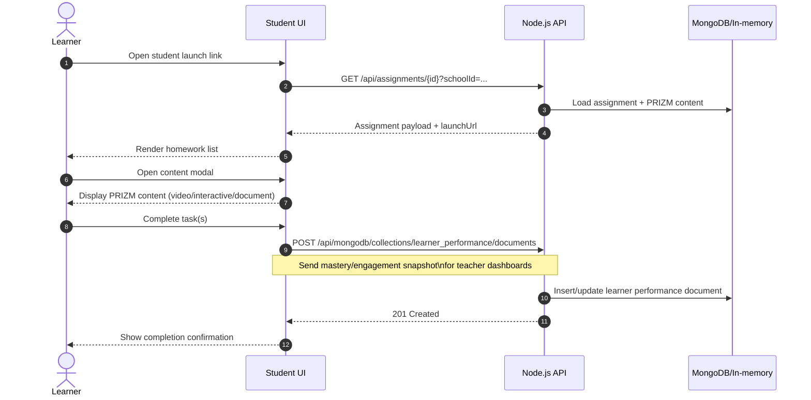

# InspiredHomework PoC API (Swagger-style summary)

This document is derived from `docs/EXTERNAL-APIS.md` and presents a Swagger-like (OpenAPI-style)
summary of the internal REST API and outbound integrations, including example payloads.

---

## Internal REST API

### Common Response/Behavior
- **Content-Type:** `application/json`
- **CORS:** `Access-Control-Allow-Origin: *`
- **Cache-Control:** `no-store`
- **Errors:** `{ "error": "Human-readable error message" }` with standard HTTP codes (400/404/405/409/500)

---

### `GET /api/health`
**Summary:** Health check endpoint.

**Response 200:**
```json
{ "status": "ok", "timestamp": 1694774400000 }
```

---

### `GET /api/schools`
**Summary:** List schools.

**Response 200:**
```json
{
  "schools": [
    { "id": "SCH-A", "name": "Northfield High School" },
    { "id": "SCH-B", "name": "Lakeside Academy" },
    { "id": "SCH-C", "name": "Riverside Prep" }
  ]
}
```

---

### `GET /api/learners`
**Summary:** List learners (optionally filtered by school).

**Query Params:**
- `schoolId` (optional): filter by school.

**Response 200:**
```json
{
  "learners": [
    {
      "id": "L001",
      "name": "Ada Lovelace",
      "email": "ada@example.com",
      "cohort": "Algebra 2",
      "status": "Active",
      "quartile": "Q1",
      "schoolId": "SCH-A"
    }
  ]
}
```

---

### `GET /api/scheme-of-work`
**Summary:** Return academic calendar (MongoDB when configured, otherwise in-memory seed).

**Response 200:**
```json
{
  "schemeOfWork": {
    "academicYear": "2024-2025",
    "subject": "A Level Mathematics",
    "level": "A Level",
    "semesters": [
      {
        "name": "Semester 1",
        "focus": "Pure mathematics foundations",
        "weeks": [
          { "week": 1, "topic": "Algebraic manipulation and surds" }
        ]
      }
    ]
  }
}
```

---

### `GET /api/content-resources`
**Summary:** List content resources filtered by topic.

**Query Params:**
- `topic` (optional): case-insensitive substring match.

**Response 200:**
```json
{
  "resources": [
    {
      "id": "RES-101",
      "topic": "Algebraic manipulation and surds",
      "difficulty": "Foundation",
      "lengthMinutes": 20,
      "type": "Activity",
      "title": "Surds simplification practice set",
      "alignedOutcomes": ["a-level.pure.algebra.surds"]
    }
  ]
}
```

---

## PRIZM Content (CRUD)

### `GET /api/prizm/content`
**Summary:** List PRIZM content with filters.

**Query Params:** `topic`, `category`, `difficulty`, `search` (all optional).

**Response 200:**
```json
{ "content": [ { "id": "PRIZM-001", "...": "..." } ], "total": 12 }
```

### `GET /api/prizm/content/{id}`
**Response 200:**
```json
{ "content": { "id": "PRIZM-001", "...": "..." } }
```

**Response 404:**
```json
{ "error": "Content not found" }
```

### `POST /api/prizm/content`
**Request Body (example):**
```json
{
  "title": "New Video Lesson",
  "description": "...",
  "topic": "Fractions",
  "category": "Video",
  "mediaType": "video/mp4",
  "difficulty": "Core",
  "duration": 600,
  "fileSize": 50000000,
  "thumbnailUrl": "https://...",
  "contentUrl": "https://...",
  "tags": ["visual"],
  "alignedStandards": ["CCSS..."],
  "alignedOutcomes": ["maths..."],
  "uploadedBy": "teacher@school.edu"
}
```

**Response 201:** `{ "content": { ... } }`

**Response 409:** `{ "error": "Content with this id already exists" }`

### `PUT /api/prizm/content/{id}`
**Request Body (example):**
```json
{ "title": "Updated Title", "difficulty": "Stretch" }
```

**Response 200:** `{ "content": { ... } }`

**Response 404:** `{ "error": "Content not found" }`

### `DELETE /api/prizm/content/{id}`
**Response 200:** `{ "deleted": true }`

**Response 404:** `{ "error": "Content not found" }`

### `GET /api/prizm/categories`
**Response 200:**
```json
{ "categories": ["All", "Video", "Interactive", "Document", "Image", "Audio"] }
```

---

## Assignments

### `POST /api/assignments`
**Summary:** Create assignment; generates student/teacher links, deep link, IMSCC package.

**Request Body (example):**
```json
{
  "title": "Week 3 Homework",
  "description": "Graphs and transformations practice",
  "tasks": ["Review class notes", "Solve practice problems"],
  "students": ["L001", "L002"],
  "groups": [],
  "schoolId": "SCH-A",
  "prizmContent": ["PRIZM-001", "PRIZM-003"],
  "ltiReturnUrl": "https://canvas.example.com/..."
}
```

**Response 201 (example):**
```json
{
  "assignment": { "id": "uuid", "title": "...", "tasks": [...], "prizmContent": [...], "...": "..." },
  "studentLaunchLink": "https://host/student.html?assignmentId=uuid&schoolId=SCH-A",
  "teacherLink": "https://host/teacher.html?assignmentId=uuid&schoolId=SCH-A",
  "deepLink": "https://canvas.example.com/...?launch_url=...",
  "imsccDownloadUrl": "https://host/api/assignments/uuid/imscc"
}
```

**Response 400:** `{ "error": "schoolId is required and must match a configured school" }`

### `GET /api/assignments`
**Summary:** List assignments (optional `schoolId`).

**Response 200:**
```json
{ "assignments": [ { "id": "uuid", "title": "...", "...": "..." } ] }
```

### `GET /api/assignments/{id}`
**Query Params:** `schoolId` (required)

**Response 200:**
```json
{
  "assignment": { "...": "..." },
  "launchUrl": "https://host/student.html?assignmentId=uuid&schoolId=SCH-A"
}
```

**Response 400:** `{ "error": "schoolId is required to open this assignment" }`

**Response 403:** `{ "error": "This assignment is not available for the requested school." }`

### `GET /api/assignments/{id}/imscc`
**Summary:** Download IMSCC ZIP (content type `application/vnd.ims.imscc`).

**Contents:** `imsmanifest.xml`, `assignment.html`, `launch.html`, `assignment.csv`, `prizm/{id}.html`.

---

## Homework Recommendations

### `POST /api/recommend-homework`
**Summary:** Basic recommendation; tries external recommender, falls back to rule-based.

**Sequence diagram (Mermaid.js):**


**Request Body (example):**
```json
{
  "learnerId": "L001",
  "topic": "Algebraic manipulation and surds",
  "maxTotalTimeMinutes": 30,
  "difficultyProfile": { "Foundation": 0.3, "Core": 0.5, "Stretch": 0.2 },
  "explain": false
}
```

**Response 200 (rule-based example):**
```json
{
  "requestId": "uuid",
  "modelVersion": "rule-based-v1",
  "homework": {
    "homeworkId": "uuid",
    "title": "Auto-generated homework for Algebraic manipulation and surds",
    "description": "...",
    "estimatedTotalTimeMinutes": 20,
    "targetDifficultyProfile": { "Foundation": 0.3, "Core": 0.5, "Stretch": 0.2 },
    "explain": false,
    "tasks": [
      {
        "sequence": 1,
        "contentId": "RES-101",
        "taskText": "Complete \"Surds simplification practice set\" (20 minutes, Foundation)",
        "estimatedTimeMinutes": 20,
        "difficulty": "Foundation"
      }
    ]
  },
  "explanations": {
    "global": "Selected up to 30 minutes of content matching the requested topic.",
    "notes": [],
    "learnerId": "L001"
  }
}
```

### `POST /api/recommendations/calendar-aware`
**Summary:** Calendar-aware recommendation (uses scheme-of-work week + learner performance).

**Sequence diagram (Mermaid.js):**


**Request Body (example):**
```json
{
  "learnerId": "L001",
  "weekNumber": 1,
  "topic": null,
  "maxTotalTimeMinutes": 30
}
```

**Response 200 (example):**
```json
{
  "requestId": "uuid",
  "modelVersion": "calendar-rule-based-v1",
  "generatedAt": "2025-09-15T10:00:00Z",
  "inputs": {
    "requestId": "...",
    "apiVersion": "2025-02-01",
    "learner": { "id": "L001", "cohort": "Algebra 2", "status": "Active" },
    "performanceSnapshot": { "mastery": [...], "recentActivity": {...} },
    "calendar": { "academicYear": "2024-2025", "weekNumber": 1, "topic": "...", "semester": "Semester 1" },
    "schemeOfWork": { "...": "..." },
    "contentCatalogue": [ { "contentId": "...", "...": "..." } ],
    "constraints": { "maxTotalTimeMinutes": 30, "targetTopic": "..." }
  },
  "homeworkRecommendation": {
    "homeworkId": "uuid",
    "title": "Week 1: Algebraic manipulation and surds",
    "topic": "Algebraic manipulation and surds",
    "weekNumber": 1,
    "estimatedTotalTimeMinutes": 20,
    "tasks": [
      {
        "sequence": 1,
        "contentId": "RES-101",
        "taskText": "Study: Surds simplification practice set (Activity, 20 mins, Foundation)",
        "estimatedTimeMinutes": 20,
        "difficulty": "Foundation",
        "alignedOutcomes": ["a-level.pure.algebra.surds"],
        "topic": "Algebraic manipulation and surds"
      }
    ]
  },
  "explanations": {
    "global": "Selected tasks for week 1 on Algebraic manipulation and surds, prioritizing outcomes with lower proficiency.",
    "notes": []
  }
}
```

### Typical merged flow: calendar-aware + recommendation response cycle
**Summary:** End-to-end use case where the UI requests a calendar-aware recommendation and then
reuses the response to drive subsequent homework review/iteration.

**Sequence diagram (Mermaid.js):**


---

### Learner experience: launch, modal interaction, and performance capture
**Summary:** Sequence from learner launch to content interaction and performance data flowing back
into MongoDB for teacher dashboards.

**Sequence diagram (Mermaid.js):**


---

## MongoDB Generic CRUD (schema-agnostic)

### `GET /api/mongodb/collections`
**Query Params:** `limit` (default 4), `sampleSize` (default 3).

**Response 200 (example):**
```json
{
  "isMock": true,
  "collections": [
    {
      "name": "learners",
      "count": 5,
      "sample": [ { "_id": "L001", "name": "Ada Lovelace", "...": "..." } ],
      "schemaFields": ["_id", "name", "email", "cohort", "status", "schoolId"]
    }
  ],
  "message": ""
}
```

### `GET /api/mongodb/collections/{collectionName}/documents`
**Query Params:** `limit` (default 20).

**Response 200:**
```json
{ "documents": [ { "_id": "...", "...": "..." } ] }
```

### `POST /api/mongodb/collections/{collectionName}/documents`
**Request Body (example):**
```json
{ "field1": "value1", "field2": "value2" }
```

**Response 201:** `{ "document": { "_id": "...", ... } }`

### `PUT /api/mongodb/collections/{collectionName}/documents/{documentId}`
**Request Body (example):**
```json
{ "field1": "newValue" }
```

**Response 200:** `{ "document": { ... } }`

**Response 404:** `{ "error": "Document not found" }`

### `DELETE /api/mongodb/collections/{collectionName}/documents/{documentId}`
**Response 200:** `{ "deleted": true }`

**Response 404:** `{ "error": "Document not found" }`

### `POST /api/mongodb/collections/{collectionName}/upsert`
### `PUT /api/mongodb/collections/{collectionName}/upsert/{documentId}`
**Request Body (example):**
```json
{
  "filter": { "id": "some-id" },
  "document": { "name": "Updated Name", "value": 42 },
  "setOnInsert": { "createdAt": "2025-01-01T00:00:00Z" }
}
```

**Response 200 (updated):** `{ "document": { ... }, "upserted": false }`

**Response 201 (inserted):** `{ "document": { ... }, "upserted": true, "upsertedId": "..." }`

---

## iSAMS Integration (Internal Orchestration Endpoints)

### `POST /api/integrations/isams/report-cycles/sync`
**Summary:** Pulls from iSAMS, uploads JSON snapshot to S3, and writes batch + cycles to PostgREST.

**Request Body (example):**
```json
{ "schoolId": "SCH-A" }
```

**Response 200 (example):**
```json
{
  "syncedAt": "2025-09-15T10:00:00Z",
  "requestUrl": "https://isams.example.com/api/batch/schoolreports/reportcycles",
  "schoolId": "SCH-A",
  "recordCount": 12,
  "storage": {
    "batchId": "uuid",
    "s3Key": "isams/report-cycles/2025-09-15T10-00-00-000Z-uuid.json",
    "recordCount": 12
  }
}
```

### `GET /api/integrations/isams/report-cycles`
**Query Params:** `schoolId` (optional), `limit` (optional).

**Response 200 (example):**
```json
{
  "reportCycles": [
    {
      "id": "123",
      "name": "Autumn Term",
      "start_date": "2024-09-01",
      "end_date": "2024-12-20",
      "academic_year": "2024-2025",
      "school_id": "SCH-A",
      "status": "active",
      "synced_at": "2025-09-15T10:00:00Z"
    }
  ]
}
```

---

## LTI 1.3 (Canvas) — Stubbed PoC Endpoints

### `POST /api/lti/launch`
**Request Body (example):**
```json
{ "role": "Learner", "assignmentId": "uuid" }
```

**Response 200 (example):**
```json
{
  "message": "Simulated LTI 1.3 launch.",
  "role": "Learner",
  "assignment": { "...": "..." },
  "launchTarget": "https://host/student.html",
  "note": "Replace with real OIDC login + JWT validation in production."
}
```

### `POST /api/lti/deep-link/{assignmentId}`
**Request Body (example):**
```json
{ "returnUrl": "https://canvas.example.com/deep_linking_response" }
```

**Response 200 (example):**
```json
{
  "assignment": { "...": "..." },
  "posted": true,
  "launchUrl": "https://host/student.html?assignmentId=uuid",
  "ltiDeepLink": "https://canvas.example.com/deep_linking_response?launch_url=...",
  "note": "In production, sign the deep-linking response using your LTI 1.3 keys."
}
```

---

## Outbound External Integrations

### Recommender API (Outbound)
- **Method:** `POST`
- **URL:** `RECOMMENDER_API_URL`
- **Auth:** `Authorization: Bearer {RECOMMENDER_API_KEY}`
- **Content-Type:** `application/json`

**Basic Request Example:**
```json
{
  "requestId": "uuid",
  "apiVersion": "2025-01-01",
  "learner": { "learnerId": "L001", "cohort": "Algebra 2", "status": "Active" },
  "context": {
    "topic": "Algebraic manipulation and surds",
    "maxTotalTimeMinutes": 30,
    "difficultyProfile": { "Foundation": 0.3, "Core": 0.5, "Stretch": 0.2 },
    "schemeOfWork": { "...": "..." },
    "schemeMatches": [{ "week": 1, "topic": "...", "semester": "...", "focus": "..." }]
  },
  "contentCatalogue": [
    {
      "contentId": "RES-101",
      "topic": "...",
      "difficulty": "Foundation",
      "lengthMinutes": 20,
      "type": "Activity",
      "title": "..."
    }
  ],
  "explain": false
}
```

**Calendar-aware Example:**
```json
{
  "requestId": "uuid",
  "apiVersion": "2025-02-01",
  "timestampUtc": "2025-09-15T10:00:00Z",
  "learner": { "id": "L001", "cohort": "Algebra 2", "status": "Active", "email": "..." },
  "performanceSnapshot": {
    "mastery": [{ "outcomeId": "...", "topic": "...", "proficiency": 0.82, "confidence": 0.9 }],
    "recentActivity": { "...": "..." }
  },
  "calendar": { "academicYear": "2024-2025", "weekNumber": 1, "topic": "...", "semester": "Semester 1" },
  "schemeOfWork": { "...": "..." },
  "contentCatalogue": [ "..." ],
  "constraints": { "maxTotalTimeMinutes": 30, "targetTopic": "..." }
}
```

---

### iSAMS API (Outbound)
- **Method:** `GET`
- **URL:** `{ISAMS_BASE_URL}{ISAMS_REPORT_CYCLES_PATH}`
- **Auth:** `{ISAMS_AUTH_HEADER}: {ISAMS_AUTH_SCHEME} {ISAMS_API_KEY}`
- **Accept:** `application/json`

---

### AWS S3 (Outbound)
- **Method:** `PUT`
- **URL:** `S3_PRESIGNED_URL` or `S3_PRESIGNED_URL_TEMPLATE` with `{key}`
- **Content-Type:** `application/json`
- **Body:** JSON payload stringified with 2-space indentation
- **Key Format:** `isams/report-cycles/{ISO-timestamp}-{batchId}.json`

---

### PostgREST (Outbound)
- **Methods:** `GET`, `POST`
- **URL:** `{PG_REST_URL}/{pathname}`
- **Auth:** `{PG_REST_AUTH_HEADER}: [{PG_REST_AUTH_SCHEME} ]{PG_REST_API_KEY}`
- **Upsert Headers:** `Prefer: resolution=merge-duplicates`

**Tables:**
- `isams_report_cycle_batches` (POST)
- `isams_report_cycles` (POST with `?on_conflict=id`, GET for querying)
